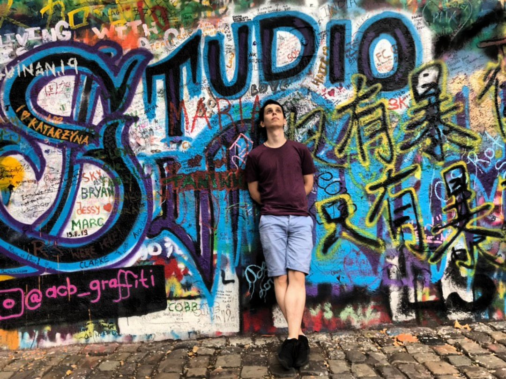

# Artur Kuchinski



## **Contacts**

**Location**: Minsk, Belarus

**Phone**: +375 25 622-11-46

**Email**: kuchinski21@inbox.ru ; vasya.rogin@inbox.ru

## **GitHub:**

_KuchinskiArtur_

## About Me

_Artur, 30 years old, I work for Alutech. I want to learn programming and find a job in this field. Hobby: making candles
I dream to travel a lot._

## Skills

- HTML

- CSS / SCSS

- JavaScript

- React

- Git

## Code Example

```
import React, { FC } from "react";
import "./Button.css";

type ButtonProps = {
className: any;
text: string;
id?: string;
onClick?: () => void;
};

const Button: FC<ButtonProps> = ({ className, text, id, onClick }) => {
return (
<button id={id} onClick={onClick} className={className}>
{text}
</button>
);
};

export default Button;
```

## work experience

**_No_**

## Education

**_Courses:_**: Teach Me Skils

**_English_**: A2
